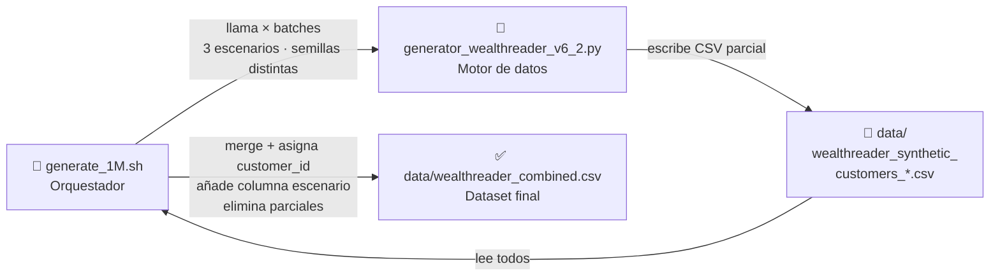
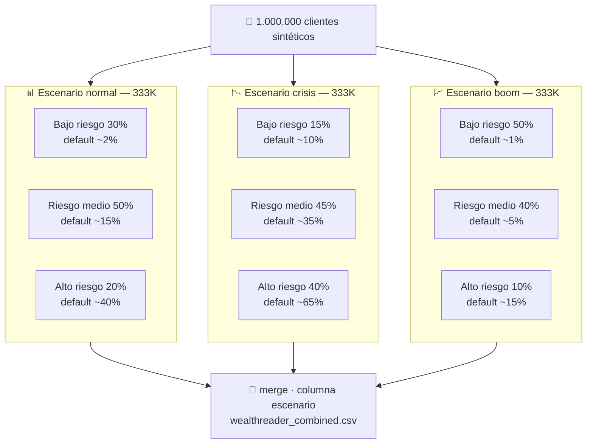

# WealthReader Synthetic Generator

A two-script pipeline to generate large-scale synthetic banking datasets based on official Spanish statistics (INE, Banco de España). Designed for training credit risk and default prediction models.

---

## How it works

The pipeline consists of two scripts that work together:



`generate_1M.sh` is the orchestrator. It drives the full generation process: it calls the Python generator repeatedly across three economic scenarios and batch sizes, then merges all partial CSV outputs into a single final file.

`generator_wealthreader_v6_2.py` is the data engine. Each call generates one batch of synthetic customers and writes a CSV to the output directory.

---

## Scripts

### `generator_wealthreader_v6_2.py`

Python script that generates synthetic banking customers using statistical distributions calibrated against official Spanish data sources:

- **INE** — Encuesta de Condiciones de Vida 2024 (ECV), Encuesta de Presupuestos Familiares 2024 (EPF), Encuesta de Estructura Salarial (EES), Encuesta de Población Activa (EPA), Censo 2024
- **Banco de España** — Encuesta Financiera de las Familias 2022 (EFF)
- **BCE / PwC** — Digital banking adoption data 2024

**What each customer record contains (52 fields):**

| Category | Fields |
|----------|--------|
| Demographics | `edad`, `birth_date`, `estado_civil`, `categoria_laboral`, `ccaa`, `zona_postal` |
| Income / Expenses | `ingreso_medio_mensual`, `ingreso_std`, `gasto_medio_mensual`, `gasto_std`, `ahorro_medio_mensual`, `meses_ahorro_positivo` |
| Bank accounts | `n_cuentas`, `n_cuentas_corrientes`, `n_depositos_plazo`, `saldo_total`, `saldo_depositos`, `tiene_linea_credito` |
| Cards | `n_tarjetas`, `tiene_tarjeta_credito`, `limite_credito_total`, `credito_dispuesto`, `ratio_utilizacion_credito` |
| Investments | `tiene_inversiones`, `valor_cartera`, `n_fondos`, `tiene_plan_pensiones`, `rentabilidad_cartera`, `aportaciones_ultimo_año` |
| Loans | `tiene_prestamo`, `tipo_prestamo`, `capital_original`, `tipo_interes`, `porcentaje_amortizado`, `deuda_pendiente`, `años_restantes`, `cuota_mensual` |
| Insurance | `tiene_seguro`, `suma_asegurada` |
| Direct debits | `n_domiciliaciones`, `importe_total_domiciliaciones`, `tiene_recibos_rechazados` |
| Target | `default_12m` |

**Default probability model — 14 calibrated factors:**

The target variable `default_12m` is computed by applying multiplicative risk factors (derived from Odds Ratios in scientific literature) to a base probability defined by the economic scenario:

| # | Factor | Source | Effect |
|---|--------|--------|--------|
| 1 | Monthly savings history | FICO (35% of score) | ×1.8 if < 3 positive months |
| 2 | No investments | EFF 2022 | ×1.4 |
| 3 | Active loan | Costa e Silva (2020) | ×1.15 |
| 4 | Debt-to-income ratio (DTI) | Kim et al. (2018), Fed Reserve | ×2.0 if DTI > 50% |
| 5 | Returned direct debits | NBER w26165 | ×3.0 |
| 6 | Credit utilization ratio | FICO (30% of score) | ×1.8 if > 80% |
| 7 | Pension plan | EFF 2022 | ×0.70 (protective) |
| 8 | Term deposit | EFF 2022 | ×0.80 (protective) |
| 9 | Stable employment | Costa e Silva (2020) OR=0.438 | ×0.75 (protective) |
| 10 | Unemployed | EPA 2024 | ×2.2 |
| 11 | Socioeconomic zone | Costa e Silva (2020) | ×0.85 zone A/B, ×1.25 zone D |
| 12 | Age + mortgage | Costa e Silva (2020) | ×0.80 if age > 45 with mortgage |
| 13 | Financial buffer (savings vs income) | EFF 2022 | ×1.5 if balance < 0.5× monthly income |
| 14 | Regional AROPE rate | INE ECV 2024 | ×1.20 if AROPE > 32% |

**Three economic scenarios:**

| Scenario | Low risk | Mid risk | High risk | Base default rate |
|----------|----------|----------|-----------|-------------------|
| `normal` | 30% | 50% | 20% | 2% / 15% / 40% |
| `crisis` | 15% | 45% | 40% | 10% / 35% / 65% |
| `boom`   | 50% | 40% | 10% | 1% / 5% / 15% |

**Scenario composition in a 1M dataset:**



**CLI usage:**

```bash
python generator_wealthreader_v6_2.py [OPTIONS]
```

| Option | Default | Description |
|--------|---------|-------------|
| `--scenario`, `-s` | `normal` | Economic scenario: `normal`, `crisis`, `boom`, `all` |
| `--customers`, `-n` | `50000` | Number of customers to generate |
| `--batch-size` | `50000` | Customers per processing batch |
| `--output-dir`, `-o` | `.` | Output directory for CSV files |
| `--suffix`, `-x` | `` | Suffix appended to output filename |
| `--seed` | `42` | Random seed for reproducibility |
| `--workers` | auto | Number of parallel CPU workers |

**Output filename format:**
- With suffix: `wealthreader_synthetic_customers_{suffix}.csv`
- Without suffix: `wealthreader_synthetic_customers_{scenario}.csv`

---

### `generate_1M.sh`

Bash orchestration script that automates the full generation of a large dataset (default: 1,000,000 customers) split evenly across the three economic scenarios.

**What it does, step by step:**

1. **Interactive configuration** — asks for total number of customers (default: 1,000,000) and output directory (default: `data`). Creates the output directory if it does not exist.

2. **Batch generation** — divides the total into three equal groups (one per scenario: normal, crisis, boom) and generates each in batches of 50,000 customers, calling `generator_wealthreader_v6_2.py` for each batch with a different random seed to ensure diversity.

   Seed series per scenario:
   - Normal: 142, 242, 342, ...
   - Crisis: 1100, 1200, 1300, ...
   - Boom: 2100, 2200, 2300, ...

3. **Merge and cleanup** — runs an embedded Python script that:
   - Reads all partial CSV files from the output directory
   - Reassigns `customer_id` sequentially across the full dataset
   - Adds an `escenario` column to each record
   - Deletes the partial files
   - Writes the final combined file `wealthreader_combined.csv`
   - Prints summary statistics (total rows, global default rate, default rate per scenario)

**Usage:**

```bash
chmod +x generate_1M.sh
./generate_1M.sh
```

The script will prompt:
```
¿Cuántas instancias quieres generar? [1000000]:
¿Directorio de salida? [data]:
¿Continuar? (s/n) [s]:
```

---

## Directory structure

```
wealthreader-synthetic-generator/
├── generator_wealthreader_v6_2.py   # Data engine
├── generate_1M.sh                   # Orchestration script
└── data/                            # Created automatically at runtime
    ├── wealthreader_synthetic_customers_normal_1.csv   # Partial (deleted after merge)
    ├── wealthreader_synthetic_customers_crisis_1.csv   # Partial (deleted after merge)
    ├── wealthreader_synthetic_customers_boom_1.csv     # Partial (deleted after merge)
    └── wealthreader_combined.csv                       # Final output
```

The `data/` directory is created automatically by `generate_1M.sh`. Partial CSV files are deleted once the merge is complete. Only `wealthreader_combined.csv` remains.

If you run `generator_wealthreader_v6_2.py` directly without `--output-dir`, files are written to the current working directory (`.`).

---

## Requirements

Python **3.11** is required. Only two external libraries are needed to run the generator:

```bash
pip install pandas numpy
```

The `generate_1M.sh` merge step also uses `glob` and `os`, which are part of the Python standard library.

**Versions used in the `wealthinsights` conda environment:**

| Library | Version |
|---------|---------|
| Python | 3.11.14 |
| pandas | 2.3.3 |
| numpy | 2.3.5 |

All other imports (`datetime`, `typing`, `argparse`, `gc`, `multiprocessing`, `warnings`, `glob`, `os`) are part of the Python standard library and require no installation.

**To replicate the exact environment:**

```bash
conda create -n wealthreader python=3.11
conda activate wealthreader
pip install pandas==2.3.3 numpy==2.3.5
```

---

## Quick start

**Generate 100,000 customers (normal scenario):**
```bash
python generator_wealthreader_v6_2.py --scenario normal --customers 100000 --output-dir data
```

**Generate all three scenarios, 50,000 each:**
```bash
python generator_wealthreader_v6_2.py --scenario all --customers 50000 --output-dir data
```

**Generate full 1M dataset via orchestration script:**
```bash
chmod +x generate_1M.sh
./generate_1M.sh
```

**Custom run with reproducible seed:**
```bash
python generator_wealthreader_v6_2.py -s crisis -n 200000 -o ./output --seed 123
```
